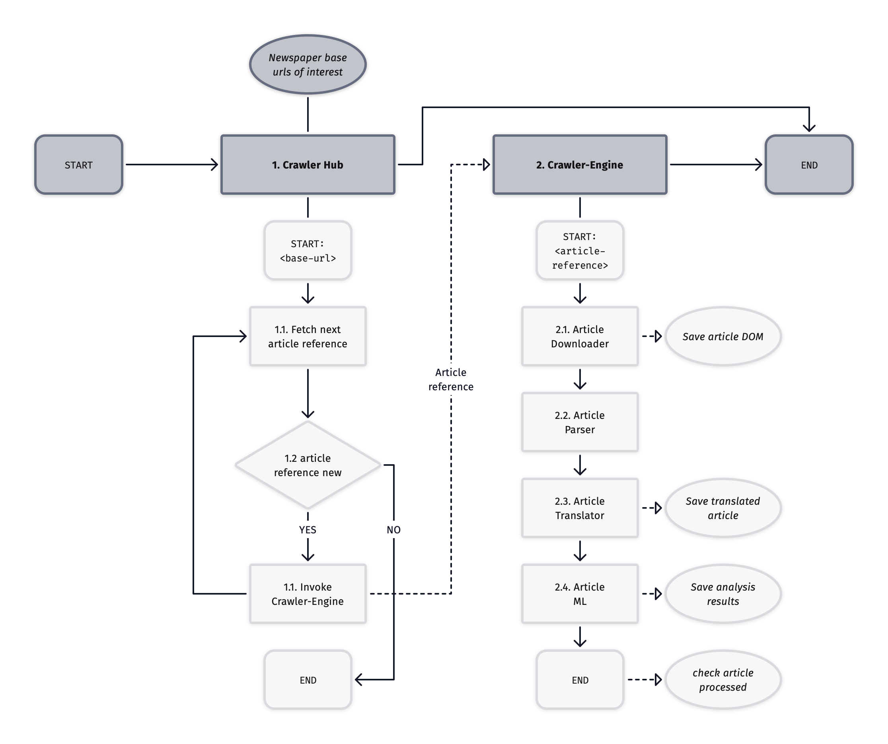

# Carly Lambda Project

This repository contains lamba functions used in the carly project.
Under the folder `carly_engine` are all the carly engine lambda functions.
Under the folder `carly_hub` are all the carly hub associated lambda functions.

More details about each lambda function is given in the related lambda directory README file.
Below is a more general diagram given setting the lambda function into context.



## Build and deployment of lambda functions

Each lambda function has a `build.sh` file that builds the lambda code into the local `./build` directory. In addition, the lambda structure is defined in `carly_config`, which is used to set information about the lambda deployment.s

```go
// todo
```
